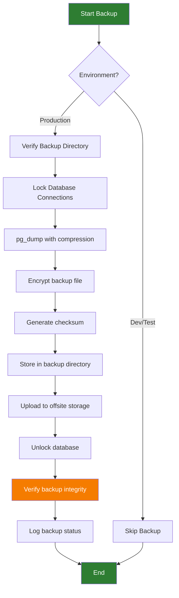
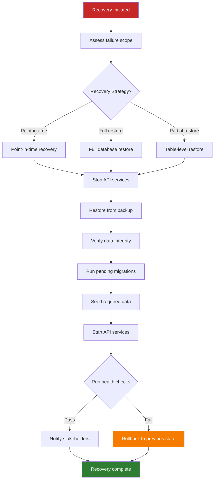
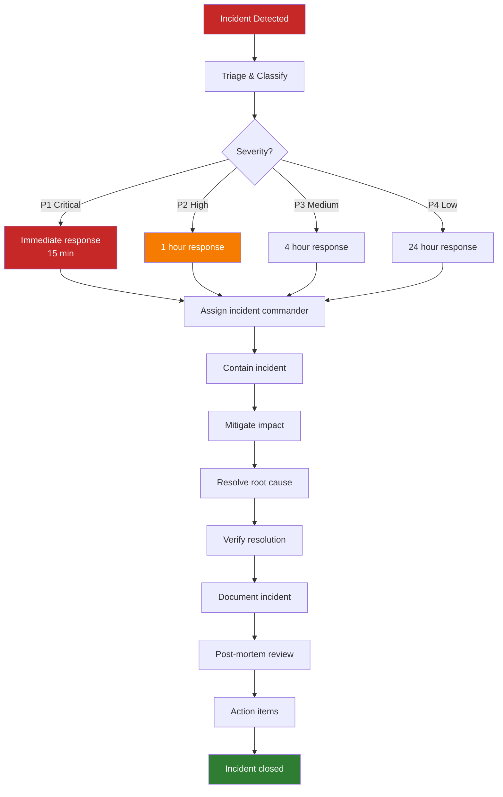

# Enterprise HSE Platform — Operations Architecture

## Backup & Recovery Flow

**Recovery Flow:**

---

## Incident Response Flow

---

## Runbook Structure

### 1. Incident Runbook
**Trigger:** Monitoring alert or user report  
**Owner:** On-call engineer  
**Steps:**
1. Acknowledge alert in PagerDuty
2. Assess severity (P1-P4)
3. Check Grafana dashboard for metrics
4. Check Loki for error logs
5. Check Tempo for trace analysis
6. Identify root cause
7. Implement mitigation or rollback
8. Update stakeholders
9. Document in incident tracker
10. Schedule post-mortem if P1/P2

### 2. Deployment Runbook
**Trigger:** Scheduled deployment or hotfix  
**Owner:** DevOps engineer  
**Steps:**
1. Verify pre-deployment checklist
2. Deploy to green environment
3. Run smoke tests
4. Switch traffic (blue → green)
5. Monitor for 15 minutes
6. Keep blue as rollback for 1 hour
7. Decommission blue after validation

### 3. Backup Restore Runbook
**Trigger:** Data loss or corruption  
**Owner:** DBA  
**Steps:**
1. Stop API services
2. Identify latest valid backup
3. Restore database from backup
4. Verify table counts and row counts
5. Run pending migrations
6. Start API services
7. Run health checks
8. Notify stakeholders

### 4. Security Incident Runbook
**Trigger:** Security alert or vulnerability discovery  
**Owner:** Security Lead  
**Steps:**
1. Isolate affected systems
2. Preserve evidence (logs, snapshots)
3. Assess scope of compromise
4. Patch vulnerability
5. Rotate compromised credentials
6. Notify security team
7. Document in security incident tracker
8. Conduct post-mortem
9. Update security controls

---

*Document End*
